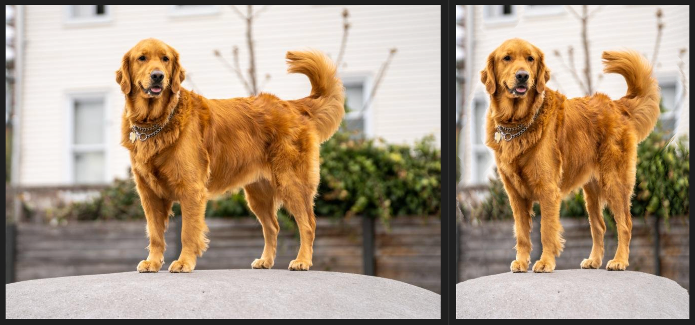

# Seam Carving

A C implementation of the seam carving algorithm for content-aware image resizing. This algorithm intelligently resizes images by removing or adding seams that have the least impact on the image content.

## Examples




## Build Instructions

1. Clone the repository:
```bash
git clone https://github.com/yourusername/seam_carving.git
cd seam_carving
```

2. Build the project:
```bash
make
```

3. Clean build artifacts (optional):
```bash
make clean
```

## Usage

The compiled executable will be available in the `build` directory. Run it with:

```bash
./build/main <input_image> <output_image>
```

## License

This project is licensed under the [MIT License](./LICENSE).